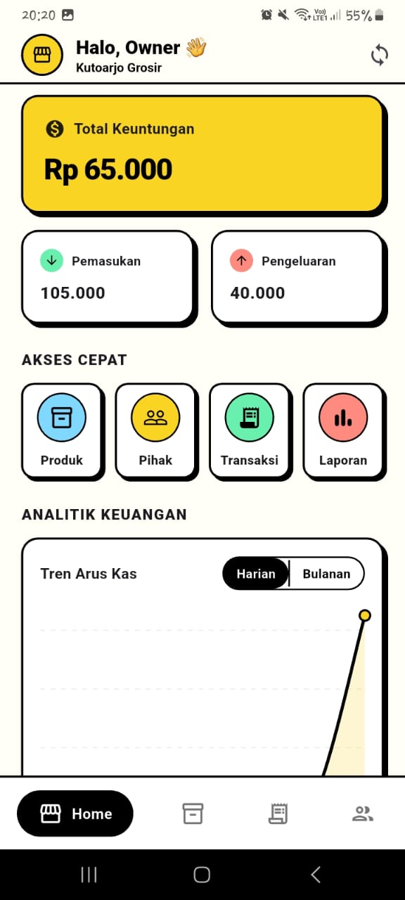
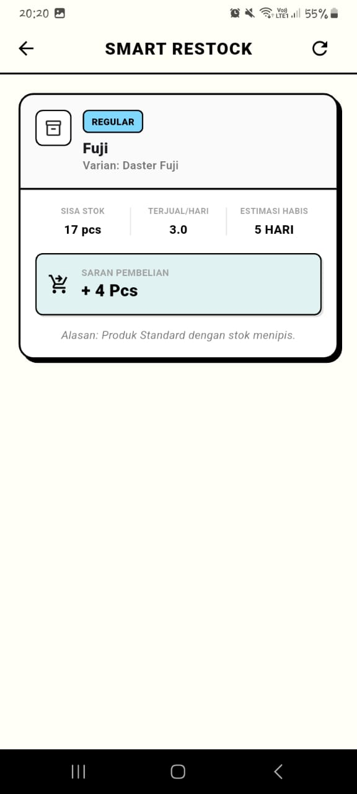
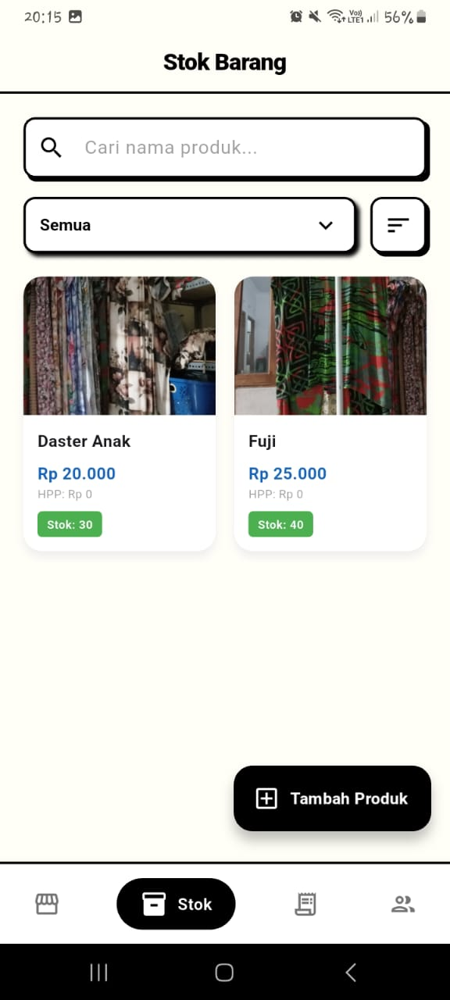
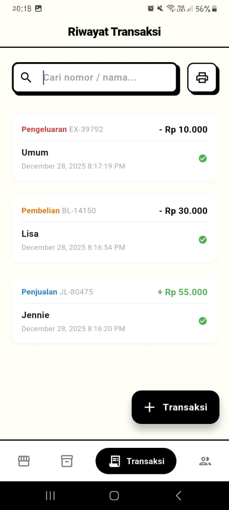

# 📦 KG (Kutoarjo Grosir) - Pocket ERP

<div align="center">


**Manajemen Bisnis UMKM dengan Gaya.** *Aplikasi Point of Sales (POS) dan Manajemen Stok dengan desain Neo-Brutalism.*

[](https://flutter.dev/)
[](https://dart.dev/)
[](LICENSE)

</div>

---

## ✨ Tentang Aplikasi

**Kutoarjo Grosir (KG)** adalah aplikasi manajemen bisnis *all-in-one* yang dirancang khusus untuk UMKM. Aplikasi ini menggabungkan fungsi Kasir (POS), Manajemen Gudang, dan Pencatatan Keuangan dalam satu platform.

Berbeda dengan aplikasi bisnis konvensional yang kaku, KG menghadirkan antarmuka **Gen-Z / Retro Elegant** yang *fresh*, berani, dan menyenangkan untuk digunakan sehari-hari, tanpa mengorbankan fungsionalitas.

## 🎨 Design Language: "Retro Pop / Neo-Brutalism"

UI/UX aplikasi ini dibangun dengan filosofi desain yang kuat:

* **High Contrast:** Penggunaan *border* hitam tebal (`2px`) pada setiap elemen interaktif.
* **Hard Shadows:** Bayangan solid tanpa *blur* untuk memberikan efek dimensi yang tegas dan *playful*.
* **Distinct Palette:**
    * 🎨 **Cream Canvas:** `#FFFFFEF7` (Background Utama)
    * 🟢 **Retro Green:** `#27AE60` (Income/Success)
    * 🔴 **Soft Red:** `#C62828` (Expense/Alert)
    * 🟡 **Pop Yellow:** `#F9D423` (Highlight/Action)
    * 🔵 **Sky Blue:** `#80D8FF` (Info/Neutral)

## 🚀 Fitur Utama

### 1. 📦 Manajemen Inventori (Gudang)
* **Multi-Varian:** Dukungan satu produk dengan banyak varian (SKU berbeda).
* **Stok Real-time:** Pemantauan jumlah fisik barang secara langsung.
* **Kategorisasi:** Pengelompokan barang agar mudah dicari.

### 2. 🧠 Smart Analysis & Restock
* **Smart Alerts:** Notifikasi otomatis jika stok menipis berdasarkan *burn rate* harian.
* **Rekomendasi Belanja:** Sistem menghitung berapa *pcs* yang harus dibeli ulang agar stok aman.
* **ABC Analysis:** Mengkategorikan produk menjadi *Winning Product*, *Standard*, atau *Slow Mover*.

### 3. 👥 Manajemen Pihak (CRM)
* Database Pelanggan & Pemasok.
* **Pencatatan Utang/Piutang:** Tracking saldo utang per pihak dengan status lunas/belum.
* Riwayat transaksi spesifik per orang.

### 4. 💰 Keuangan & Transaksi
* **Pencatatan Fleksibel:** Penjualan, Pembelian, Uang Masuk (Modal), dan Uang Keluar (Operasional).
* **Grafik Tren:** Visualisasi arus kas Harian & Bulanan menggunakan *Line Chart* retro.
* **Laporan PDF:** Generate laporan siap cetak untuk audit.

## 📱 Screenshots

| **Dashboard** | **Smart Analysis** |
|:---:|:---:|
|  |  |
| *Ringkasan keuangan & menu cepat* | *Rekomendasi belanja cerdas* |

| **List Produk** | **Input Transaksi** |
|:---:|:---:|
|  |  |
| *Manajemen stok gaya retro* | *Form input yang bersih & tegas* |

## 🛠️ Tech Stack

* **Framework:** [Flutter](https://flutter.dev/)
* **Language:** Dart
* **State Management:** [Provider](https://pub.dev/packages/provider)
* **Local Database:** [sqflite](https://pub.dev/packages/sqflite)
* **Charting:** [fl_chart](https://pub.dev/packages/fl_chart)
* **Formatting:** [intl](https://pub.dev/packages/intl)
* **PDF:** [pdf](https://pub.dev/packages/pdf) & [printing](https://pub.dev/packages/printing)

## 📂 Struktur Folder

```bash
lib/
├── models/          # Data Models (Transaction, Product, Party)
├── pages/           # Halaman Utama (HomeWrapper, dll)
├── providers/       # State Management Logic (Business Logic)
├── services/        # Logic Berat (Database, Smart Analysis, PDF)
├── ui/              # Tampilan Antarmuka (Views)
│   ├── analysis/    # Layar Analisis & Detail Gudang
│   ├── auth/        # Layar Login
│   ├── inventory/   # Layar List & Edit Produk
│   ├── party/       # Layar Daftar & Detail Pihak
│   └── transaction/ # Layar Riwayat & Form Transaksi
├── utils/           # Konstanta Warna, Helper Format
└── widgets/         # Reusable Widgets (Retro Card, Buttons, Navbar)
```
🏁 Cara Menjalankan
Ikuti langkah ini untuk menjalankan aplikasi di komputer Anda:

Clone Repository

```bash

git clone [https://github.com/MCat-arch/kutoarjoGrosir_inventoryManagement](https://github.com/MCat-arch/kutoarjoGrosir_inventoryManagement)
cd kutoarjo-grosir

```
Install Dependencies Pastikan Flutter SDK sudah terinstall.

```bash

flutter pub get

Run App Jalankan di Emulator atau Device fisik.

```
flutter run 
bash ```
🤝 Kontribusi
Kontribusi selalu terbuka! Jika Anda ingin menambahkan fitur atau memperbaiki bug:

Note: Mohon pertahankan gaya desain Neo-Brutalism (Border tebal, warna solid) pada setiap komponen UI baru.

<div align="center">
```

Dibuat dengan ❤️ dan ☕ untuk UMKM Indonesia.

</div>
